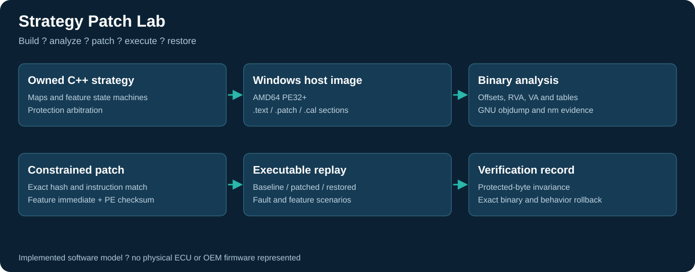

# Strategy Patch Lab

A complete owned-binary modification exercise: build a C++ strategy model, analyze its executable and calibration section, generate a narrowly scoped patch, correct the PE checksum, execute before/after scenarios and restore the exact original image.

**Target:** Windows x86-64 PE32+ host executable built with MinGW g++. **Not TriCore, AURIX or Bosch firmware.** The explicit patch site makes this a reproducible engineering lab, not a claim of discovering an unknown OEM strategy. Independently prepared with AI assistance for this technical review.



## Run the full workflow

Requires Windows x86-64, Python 3.10+, and MinGW `g++`, `objdump` and `nm` on PATH.

```powershell
python verify.py
python -m patchlab inspect build/strategy_baseline.exe
.\build\strategy_patched.exe scenarios/integration.csv
```

The verifier builds three executable artifacts under `build/`: baseline, patched and restored, plus a strategy test executable. It regenerates named evidence files. No proprietary binaries or physical ECU interfaces are involved.

## Strategy implementation

| Feature | Implemented model |
|---|---|
| Map switching | Three 3x3 torque maps; bilinear interpolation; stationary/brake/low-pedal interlock; debounce and dwell |
| Ethanol compensation | Plausibility and freshness checks; filtered composition; density-based mass blending; bounded fuel-mass multiplier |
| Launch | Time-limited torque request with speed/brake/thermal gates and held-button lockout |
| Flat-foot shift | Clutch-edge-triggered torque reduction with a bounded duration and re-arm behavior |
| Protections | Thermal and overspeed override; stale-sensor limp limit; torque-tracking latch; positive torque slew limit; stored diagnostic flags |

Fuel compensation is a mathematical model, not a production flex-fuel implementation: injector characterization, closed-loop lambda, transient fueling, cold start, ignition and combustion validation are not modeled. Launch/shift functions output torque requests only. Anti-lag and crackle are not implemented. All outputs remain in a CSV replay; they do not actuate an engine.

## Actual binary work

- Parses the PE header, section table, image base, RVA and file offsets.
- Locates one owned machine-code feature gate in executable `.patch`.
- Extracts 33 IEEE-754 calibration values from `.cal`, including axes and three maps.
- Requires exact baseline SHA-256 and expected instruction bytes before modification.
- Changes only the permitted feature-mask instruction and PE checksum field.
- Verifies all other bytes remain identical, including `.text`, `.cal`, `.rdata` and unwind metadata.
- Compares the checksum implementation against Windows `CheckSumMappedFile`.
- Records forward and rollback hashes; rollback must reconstruct the exact original image.

This modifies existing machine code; it does not inject a new executable segment, discover arbitrary control-flow hooks or solve an OEM signature scheme.

## Evidence to review

| Artifact | Meaning |
|---|---|
| `evidence/baseline_analysis.json` | Actual sections, addresses, calibration values and checksum |
| `evidence/patch_manifest.json` | Baseline hash and exact-byte patch preconditions |
| `evidence/patch_receipt.json` | Changed offsets, candidate hash and rollback material |
| `evidence/*_disassembly.txt` | Actual GNU objdump output before and after patch |
| `evidence/relevant_symbols.txt` | Actual symbol addresses from the built image |
| `evidence/calibration_hex.txt` | Actual `.cal` bytes |
| `evidence/*_trace.csv` | Baseline, patched and restored executable outputs |
| `evidence/strategy_validation.png` | Plot of executed simulated behavior |
| `evidence/strategy_tests.txt`, `patch_tests.txt` | Actual test output |

The full workflow passed 69,011 C++ assertions, eleven Python test methods and a 421-row scenario per executable. Many assertions are repeated invariants over generated inputs; they are not 69,011 independent requirements. Binary rollback and restored replay are checked for exact equality.

Read [binary analysis](docs/BINARY_ANALYSIS.md), [strategy design](docs/STRATEGY_DESIGN.md) and [validation limits](docs/VALIDATION.md) for the implementation details and remaining work.

Format reference: [Microsoft PE/COFF specification](https://learn.microsoft.com/en-us/windows/win32/debug/pe-format). This PE checksum work does not establish experience correcting a Bosch checksum or signature.

## Ownership and permissions

Copyright (c) 2026 **Abdullah Shabbir**. All rights reserved.

Public availability is for inspection and does not grant permission to reuse, run, modify, distribute or deploy the original materials. Written permission is required, subject to applicable law and GitHub's public-repository terms. See [LICENSE](LICENSE). Build and test instructions are for the owner and authorized users.

## Continuous integration template

`ci/github-actions.yml` contains the GitHub Actions configuration. It is provided as a template and is not enabled in this repository. To enable it, an authorized maintainer with GitHub workflow-write permission can place it at `.github/workflows/ci.yml`. Local validation results are included under `evidence/`.
