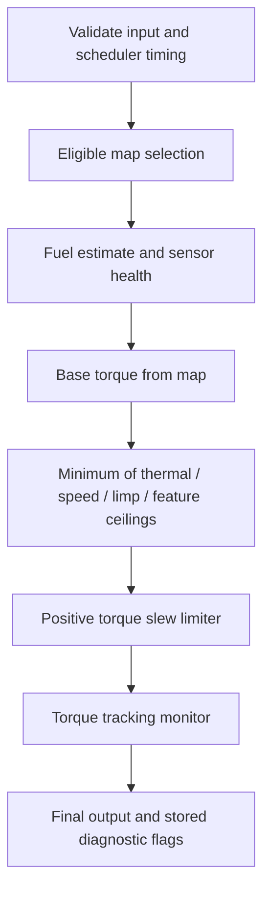

# Strategy design and protection ordering

## Execution contract

The caller supplies a timestamp and one coherent sensor snapshot. The model is single-owner, has no hardware I/O and produces torque requests and a fuel multiplier. Integer timestamps use modular arithmetic; elapsed intervals must be below 2^31 ms. A scheduler gap above 500 ms returns zero commanded torque for that sample, resets transient feature state and records a diagnostic.

## Calibration

`.cal` holds exactly 33 little-endian IEEE-754 floats: three RPM breakpoints, three pedal breakpoints and three row-major 3x3 torque maps. The C++ layout is checked with a 132-byte static assertion. A separate translation unit and disabled LTO keep the runtime table as a real binary object.

Axes must be finite and increasing; pedal endpoints must be 0 and 100. Table values must be finite and within 0-350 Nm. Interpolation clamps inputs to the supported axes and applies bilinear interpolation. These are illustrative numbers, not vehicle calibration recommendations.

## Map switching

The feature accepts a request only while speed is below 1 km/h, RPM below 1500, pedal below 5%, and brake is active. The same request must remain eligible for 200 ms, with at least 500 ms since the previous switch. Unsafe conditions clear the pending request. The active map is volatile and defaults to map 0 on construction; no persistence is implied.

## Ethanol compensation

Valid composition is 0-85%; age must be at most 250 ms. The first valid reading initializes the estimate. Later readings use a first-order filter with a nominal 500 ms time constant. Approximate reference densities convert volume fraction to mass fraction; stoichiometric AFR is blended between reference values. The output multiplier is clamped to 1.0-1.6.

An invalid reading retains the previous estimate, records a DTC and restricts torque to 60 Nm. If no valid estimate existed, the fallback is the initial gasoline estimate. This is a demonstration fallback requiring redesign for an actual fuel system. It cannot establish safe fueling on a real high-ethanol engine. Injector flow, pressure, dead time, lambda feedback, fuel temperature, wall wetting, cold start and ignition behavior are outside the model.

## Launch and flat-foot shift

Launch applies a temporary torque ceiling when the driver requests it, the brake is active, speed is below 3 km/h, pedal exceeds 20%, coolant is below 110 C and RPM below 6500. The ceiling is 80 Nm above 3000 RPM and 150 Nm otherwise. It lasts no more than 2000 ms and requires button release to re-arm. This is not a closed-loop launch RPM controller.

Flat shift responds to a rising clutch edge at pedal above 80%, speed above 10 km/h and RPM above 2500, with the same thermal/overspeed eligibility. The torque ceiling is 60 Nm for at most 150 ms. Holding the clutch does not retrigger it. Neither feature implements ignition cuts, throttle actuation or transmission synchronization.

## Arbitration order

Thermal derating starts above 105 C and reaches zero at 130 C. RPM at or above 6500 forces zero torque. Positive torque rises at most 100 Nm/s; reductions apply immediately. Persistently measured torque more than 50 Nm above the computed command for 100 ms latches a torque-monitor fault and a 60 Nm limp ceiling. The latch resets only with a new Strategy instance, representing a key cycle. Diagnostics persist within that instance; they are not NVRAM-backed UDS records.

The baseline and patched binaries share this protection implementation byte-for-byte. Tests demonstrate modeled protections for selected and generated input sequences. Binary identity alone does not prove semantic safety, and there is no OEM diagnostic or torque-monitor integration in this lab.
